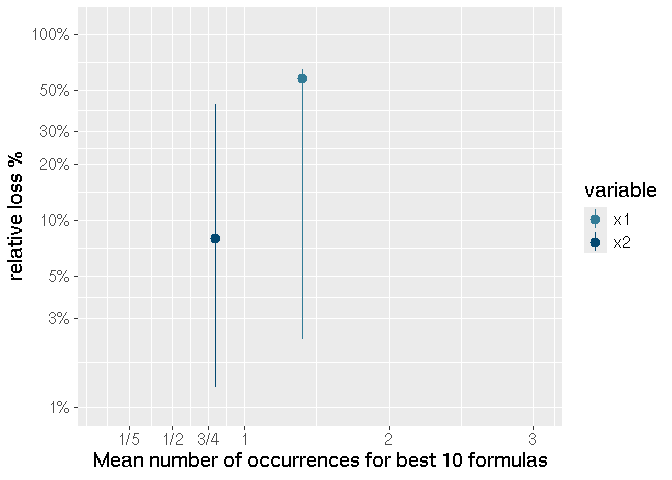

<!-- README.md is generated from README.Rmd. Please edit that file -->
<!-- TOC start (generated with https://github.com/derlin/bitdowntoc) -->

# Table of Contents

- [SymbolicR](#symbolicr)
  - [Installation](#installation)
  - [Genetic search](#genetic-search)
  - [Random search](#random-search)
  - [Combinatorial Search](#combinatorial-search)
  - [Analyze formula variables](#analyze-formula-variables)

<!-- TOC end -->

# SymbolicR

[](https://zenodo.org/doi/10.5281/zenodo.12904321)
<!-- badges: start --> <!-- badges: end -->

Find non-linear formulas that fits your input data. You can
systematically explore and memoize the possible formulas and its
cross-validation performance, in an incremental fashon. Three main
interoperable search functions are available:

- `random.search` performs a random exploration,
- `genetic.search` employs a genetic optimization algorithm
- `comb.search` allows the user to provide a data.frame of formulas to
  be tested

After installation, see tutorials with

``` r
browseVignettes('symbolicr')
```

## Installation

You can install the development version of symbolicr like so:

``` r
devtools::install_github('cosbi-research/symbolicr', build_vignettes = TRUE)
```

## Genetic search

This is a minimum viable example on how to use genetic search to find
the non-linear relationship:

``` r
library(symbolicr)
set.seed(1)

x1<-runif(100, min=2, max=67)
x2<-runif(100, min=0.01, max=0.1)

y <- log10(x1^2*x2) + rnorm(100, 0, 0.001)

X <- data.frame(x1=x1, x2=x2)

results <- genetic.search(
  X, y, 
  n.squares=2, 
  max.formula.len = 1, 
  N=2,
  K=10,
  best.vars.l = list(
   c('log.x1')
  ),
  transformations = list(
   "log"=function(rdf, x, stats){ log(x) },
   "inv"=function(rdf, x, stats){ 1/x }
  ),
  keepBest=T,
  cv.norm=F
)
#> [1] "## Total number of single terms: 27"
#> [1] "Iteration: 1 Mean/Max fitness:-9.80e+07 / 1.66e+00 Best: log.x1"
#> [1] "Iteration: 2 Mean/Max fitness:-9.80e+07 / 1.66e+00 Best: log.x1"
#> [1] "Iteration: 3 Mean/Max fitness:-9.80e+07 / 1.66e+00 Best: log.x1"
#> [1] "Iteration: 4 Mean/Max fitness:-9.60e+07 / 1.66e+00 Best: log.x1"
#> [1] "Iteration: 5 Mean/Max fitness:-9.40e+07 / 1.66e+00 Best: log.x1"
#> [1] "Iteration: 6 Mean/Max fitness:-9.40e+07 / 1.66e+00 Best: log.x1"
#> [1] "Iteration: 7 Mean/Max fitness:-9.40e+07 / 1.66e+00 Best: log.x1"
#> [1] "Iteration: 8 Mean/Max fitness:-9.40e+07 / 1.66e+00 Best: log.x1"
#> [1] "Iteration: 9 Mean/Max fitness:-9.60e+07 / 1.66e+00 Best: log.x1"
#> [1] "Iteration: 10 Mean/Max fitness:-9.60e+07 / 1.66e+00 Best: log.x1"
#> [1] "Iteration: 11 Mean/Max fitness:-9.60e+07 / 1.66e+00 Best: log.x1"
#> [1] "Iteration: 12 Mean/Max fitness:-9.60e+07 / 1.66e+00 Best: log.x1"
#> [1] "Iteration: 13 Mean/Max fitness:-9.40e+07 / 1.66e+00 Best: log.x1"
#> [1] "Iteration: 14 Mean/Max fitness:-9.40e+07 / 1.66e+00 Best: log.x1"
#> [1] "Iteration: 15 Mean/Max fitness:-9.60e+07 / 1.66e+00 Best: log.x1"
#> [1] "Iteration: 16 Mean/Max fitness:-9.40e+07 / 1.66e+00 Best: log.x1"
#> [1] "Iteration: 17 Mean/Max fitness:-9.60e+07 / 1.66e+00 Best: log.x1"
#> [1] "Iteration: 18 Mean/Max fitness:-9.40e+07 / 1.66e+00 Best: log.x1"
#> [1] "Iteration: 19 Mean/Max fitness:-9.00e+07 / 1.69e+00 Best: log.x1"
#> [1] "Iteration: 20 Mean/Max fitness:-9.60e+07 / 1.69e+00 Best: log.x1"
#> [1] "Iteration: 21 Mean/Max fitness:-9.00e+07 / 1.69e+00 Best: log.x1"
#> [1] "Iteration: 22 Mean/Max fitness:-9.40e+07 / 1.69e+00 Best: log.x1"
#> [1] "Iteration: 23 Mean/Max fitness:-9.40e+07 / 1.69e+00 Best: log.mul.x1.x1"
#> [1] "Iteration: 24 Mean/Max fitness:-9.60e+07 / 1.69e+00 Best: log.mul.x1.x1"
#> [1] "Iteration: 25 Mean/Max fitness:-9.60e+07 / 1.69e+00 Best: log.mul.x1.x1"
#> [1] "Iteration: 26 Mean/Max fitness:-9.40e+07 / 1.71e+00 Best: log.x1"
#> [1] "Iteration: 27 Mean/Max fitness:-9.60e+07 / 1.71e+00 Best: log.x1"
#> [1] "Iteration: 28 Mean/Max fitness:-9.60e+07 / 1.71e+00 Best: log.x1"
#> [1] "Iteration: 29 Mean/Max fitness:-9.40e+07 / 1.71e+00 Best: log.x1"
#> [1] "Iteration: 30 Mean/Max fitness:-9.40e+07 / 1.71e+00 Best: log.x1"
#> [1] "Iteration: 31 Mean/Max fitness:-9.40e+07 / 1.71e+00 Best: log.x1"
#> [1] "Iteration: 32 Mean/Max fitness:-9.40e+07 / 1.71e+00 Best: log.x1"
#> [1] "Iteration: 33 Mean/Max fitness:-9.60e+07 / 1.71e+00 Best: log.x1"
#> [1] "Iteration: 34 Mean/Max fitness:-9.40e+07 / 1.71e+00 Best: log.x1"
#> [1] "Iteration: 35 Mean/Max fitness:-9.60e+07 / 1.71e+00 Best: log.x1"
#> [1] "Iteration: 36 Mean/Max fitness:-9.60e+07 / 1.71e+00 Best: log.x1"
#> [1] "Iteration: 37 Mean/Max fitness:-9.40e+07 / 1.71e+00 Best: log.x1"
#> [1] "Iteration: 38 Mean/Max fitness:-9.60e+07 / 1.71e+00 Best: log.x1"
#> [1] "Iteration: 39 Mean/Max fitness:-9.60e+07 / 1.71e+00 Best: log.x1"
#> [1] "Iteration: 40 Mean/Max fitness:-9.40e+07 / 1.71e+00 Best: log.x1"
#> [1] "Iteration: 41 Mean/Max fitness:-9.20e+07 / 1.71e+00 Best: log.x1"
#> [1] "Iteration: 42 Mean/Max fitness:-9.40e+07 / 1.71e+00 Best: log.x1"
#> [1] "Iteration: 43 Mean/Max fitness:-9.20e+07 / 1.71e+00 Best: log.x1"
#> [1] "Iteration: 44 Mean/Max fitness:-9.60e+07 / 1.71e+00 Best: log.x1"
#> [1] "Iteration: 45 Mean/Max fitness:-9.60e+07 / 1.71e+00 Best: log.x1"
#> [1] "Iteration: 46 Mean/Max fitness:-9.60e+07 / 1.71e+00 Best: log.x1"
#> [1] "Iteration: 47 Mean/Max fitness:-9.60e+07 / 1.71e+00 Best: log.x1"
#> [1] "Iteration: 48 Mean/Max fitness:-9.60e+07 / 1.71e+00 Best: log.x1"
#> [1] "Iteration: 49 Mean/Max fitness:-9.60e+07 / 1.71e+00 Best: log.x1"
#> [1] "Iteration: 50 Mean/Max fitness:-9.60e+07 / 1.71e+00 Best: log.x1"
#> [1] "Iteration: 51 Mean/Max fitness:-9.20e+07 / 1.71e+00 Best: log.x1"
#> [1] "Iteration: 52 Mean/Max fitness:-9.20e+07 / 1.71e+00 Best: log.x1"
#> [1] "Iteration: 53 Mean/Max fitness:-9.60e+07 / 1.71e+00 Best: log.x1"
#> [1] "Iteration: 54 Mean/Max fitness:-9.40e+07 / 1.71e+00 Best: log.x1"
#> [1] "Iteration: 55 Mean/Max fitness:-9.60e+07 / 1.71e+00 Best: log.x1"
#> [1] "Iteration: 56 Mean/Max fitness:-9.20e+07 / 1.71e+00 Best: log.x1"
#> [1] "Iteration: 57 Mean/Max fitness:-9.60e+07 / 1.71e+00 Best: log.x1"
#> [1] "Iteration: 58 Mean/Max fitness:-9.40e+07 / 1.71e+00 Best: log.x1"
#> [1] "Iteration: 59 Mean/Max fitness:-9.20e+07 / 1.71e+00 Best: log.x1"
#> [1] "Iteration: 60 Mean/Max fitness:-9.60e+07 / 1.71e+00 Best: log.x1"
#> [1] "Iteration: 61 Mean/Max fitness:-9.60e+07 / 1.71e+00 Best: log.x1"
#> [1] "Iteration: 62 Mean/Max fitness:-9.60e+07 / 1.71e+00 Best: log.x1"
#> [1] "Iteration: 63 Mean/Max fitness:-9.60e+07 / 1.71e+00 Best: log.x1"
#> [1] "Iteration: 64 Mean/Max fitness:-9.40e+07 / 1.71e+00 Best: log.x1"
#> [1] "Iteration: 65 Mean/Max fitness:-9.40e+07 / 1.71e+00 Best: log.x1"
#> [1] "Iteration: 66 Mean/Max fitness:-9.60e+07 / 1.71e+00 Best: log.x1"
#> [1] "Iteration: 67 Mean/Max fitness:-9.40e+07 / 6.22e+00 Best: log.mul.x1.mul.x1.x2"
#> [1] "Iteration: 68 Mean/Max fitness:-9.40e+07 / 6.22e+00 Best: log.mul.x1.mul.x1.x2"
#> [1] "Iteration: 69 Mean/Max fitness:-9.40e+07 / 6.22e+00 Best: log.mul.x1.mul.x1.x2"
#> [1] "Iteration: 70 Mean/Max fitness:-9.20e+07 / 6.22e+00 Best: log.mul.x1.mul.x1.x2"
#> [1] "Iteration: 71 Mean/Max fitness:-9.20e+07 / 6.22e+00 Best: log.mul.x1.mul.x1.x2"
#> [1] "Iteration: 72 Mean/Max fitness:-9.20e+07 / 6.22e+00 Best: log.mul.x1.mul.x1.x2"
#> [1] "Iteration: 73 Mean/Max fitness:-9.40e+07 / 6.23e+00 Best: log.mul.x1.mul.x1.x2"
#> [1] "Iteration: 74 Mean/Max fitness:-9.40e+07 / 6.23e+00 Best: log.mul.x1.mul.x1.x2"
#> [1] "Iteration: 75 Mean/Max fitness:-9.60e+07 / 6.23e+00 Best: log.mul.x1.mul.x1.x2"
#> [1] "Iteration: 76 Mean/Max fitness:-9.40e+07 / 6.23e+00 Best: log.mul.x1.mul.x1.x2"
#> [1] "Iteration: 77 Mean/Max fitness:-9.40e+07 / 6.23e+00 Best: log.mul.x1.mul.x1.x2"
#> [1] "Iteration: 78 Mean/Max fitness:-9.60e+07 / 6.23e+00 Best: log.mul.x1.mul.x1.x2"
#> [1] "Iteration: 79 Mean/Max fitness:-9.60e+07 / 6.23e+00 Best: log.mul.x1.mul.x1.x2"
#> [1] "Iteration: 80 Mean/Max fitness:-9.60e+07 / 6.23e+00 Best: log.mul.x1.mul.x1.x2"
#> [1] "Iteration: 81 Mean/Max fitness:-9.60e+07 / 6.23e+00 Best: log.mul.x1.mul.x1.x2"
#> [1] "Iteration: 82 Mean/Max fitness:-9.60e+07 / 6.23e+00 Best: log.mul.x1.mul.x1.x2"
#> [1] "Iteration: 83 Mean/Max fitness:-9.60e+07 / 6.23e+00 Best: log.mul.x1.mul.x1.x2"
#> [1] "Iteration: 84 Mean/Max fitness:-9.60e+07 / 6.23e+00 Best: log.mul.x1.mul.x1.x2"
#> [1] "Iteration: 85 Mean/Max fitness:-9.40e+07 / 6.23e+00 Best: log.mul.x1.mul.x1.x2"
#> [1] "Iteration: 86 Mean/Max fitness:-9.40e+07 / 6.23e+00 Best: log.mul.x1.mul.x1.x2"
#> [1] "Iteration: 87 Mean/Max fitness:-9.60e+07 / 6.23e+00 Best: log.mul.x1.mul.x1.x2"
#> [1] "Iteration: 88 Mean/Max fitness:-9.60e+07 / 6.23e+00 Best: log.mul.x1.mul.x1.x2"
#> [1] "Iteration: 89 Mean/Max fitness:-9.60e+07 / 6.23e+00 Best: log.mul.x1.mul.x1.x2"
#> [1] "Iteration: 90 Mean/Max fitness:-9.40e+07 / 6.23e+00 Best: log.mul.x1.mul.x1.x2"
#> [1] "Iteration: 91 Mean/Max fitness:-9.40e+07 / 6.23e+00 Best: log.mul.x1.mul.x1.x2"
#> [1] "Iteration: 92 Mean/Max fitness:-9.40e+07 / 6.23e+00 Best: log.mul.x1.mul.x1.x2"
#> [1] "Iteration: 93 Mean/Max fitness:-9.60e+07 / 6.23e+00 Best: log.mul.x1.mul.x1.x2"
#> [1] "Iteration: 94 Mean/Max fitness:-9.40e+07 / 6.23e+00 Best: log.mul.x1.mul.x1.x2"
#> [1] "Iteration: 95 Mean/Max fitness:-9.20e+07 / 6.23e+00 Best: log.mul.x1.mul.x1.x2"
#> [1] "Iteration: 96 Mean/Max fitness:-9.20e+07 / 6.23e+00 Best: log.mul.x1.mul.x1.x2"
#> [1] "Iteration: 97 Mean/Max fitness:-9.20e+07 / 6.23e+00 Best: log.mul.x1.mul.x1.x2"
#> [1] "Iteration: 98 Mean/Max fitness:-9.40e+07 / 6.23e+00 Best: log.mul.x1.mul.x1.x2"
#> [1] "Iteration: 99 Mean/Max fitness:-9.00e+07 / 6.23e+00 Best: log.mul.x1.mul.x1.x2"
#> [1] "Iteration: 100 Mean/Max fitness:-9.20e+07 / 6.23e+00 Best: log.mul.x1.mul.x1.x2"
```

We found the correct non-linear formula starting from an initial guess!
We can now get the best formula

``` r
results$best
#> [1] "log.mul.x1.mul.x1.x2"
```

And all the formula the genetic algorithm found to be best at each one
of the 100 evolution iterations (last 5 shown for brevity)

``` r
results$best.iter[seq(length(results$best.iter)-5,length(results$best.iter))]
#> [[1]]
#> [1] "log.mul.x1.mul.x1.x2"
#> 
#> [[2]]
#> [1] "log.mul.x1.mul.x1.x2"
#> 
#> [[3]]
#> [1] "log.mul.x1.mul.x1.x2"
#> 
#> [[4]]
#> [1] "log.mul.x1.mul.x1.x2"
#> 
#> [[5]]
#> [1] "log.mul.x1.mul.x1.x2"
#> 
#> [[6]]
#> [1] "log.mul.x1.mul.x1.x2"
```

Note that `cv.norm=FALSE` means data is used as-is. Before running this
example we checked for the non-negativeness of `x1^2*x2`. If you would
like to normalize data to avoid scaling issues just use `cv.norm=TRUE`
but in this case, to avoid computing the log of a negative value, we use
this updated transformation function

``` r
# NB: function applied to standardized X values!
   #     they can be negative
log.std <- function(x, stats){ log(0.1 + abs(stats$min) + x) }
```

The `stats` object contains - min: the minimum of the column values -
absmin: the minimum of the absolute values of the columns - absmax: the
maximum of the absolute values of the columns - projzero: -mean/sd of
the columns, that is the position of the zero in the original,
non-normalized space.

Type `?dataset.min.maxs` in your R console for further informations.

## Random search

This is a minimum viable example on how to use random search to test
multiple non-linear relationships, and get a summary of the performances
in a data.frame:

``` r

random.results <- random.search(
  X, y, 
  n.squares=2, 
  formula.len = 1, 
  N=2,
  K=10,
  transformations = list(
   "log"=function(rdf, x, stats){ log(x) },
   "inv"=function(rdf, x, stats){ 1/x }
  ),
  cv.norm=F
)
#> [1] "Regression on mul.x2.mul.x2.x2"
#> [1] "Regression on log.mul.x1.x2"
#> [1] "Regression on inv.mul.x1.mul.x2.x2"
#> [1] "Regression on mul.x1.x1"
#> [1] "Regression on mul.x1.x2"
#> [1] "Regression on x2"
#> [1] "Regression on x1"
#> [1] "Regression on log.x2"
#> [1] "Regression on mul.x1.mul.x1.x1"
#> [1] "Regression on log.mul.x2.x2"
#> [1] "Regression on inv.mul.x2.x2"
#> [1] "Regression on inv.x2"
#> [1] "Regression on inv.mul.x1.mul.x1.x2"
#> [1] "Regression on log.mul.x1.mul.x2.x2"
#> [1] "Regression on inv.mul.x2.mul.x2.x2"
#> [1] "Regression on inv.mul.x1.mul.x1.x1"
#> [1] "Regression on inv.x1"
#> [1] "Regression on log.mul.x1.mul.x1.x1"
#> [1] "Regression on mul.x2.x2"
#> [1] "Regression on log.mul.x1.mul.x1.x2"
#> [1] "Regression on inv.mul.x1.x2"
#> [1] "Regression on log.mul.x2.mul.x2.x2"
#> [1] "Regression on log.mul.x1.x1"
#> [1] "Regression on inv.mul.x1.x1"
#> [1] "Regression on mul.x1.mul.x1.x2"
#> [1] "Regression on log.x1"
#> [1] "Regression on mul.x1.mul.x2.x2"
```

You can then inspect results in the resulting data.frame:

``` r
random.results[order(random.results$base.r.squared, decreasing = T), ][seq(5), ]
#>         base.pe  base.cor base.r.squared base.max.pe  base.iqr.pe
#> 20 0.0004285218 0.9999988      0.9999976 0.004748987 0.0005285826
#> 2  0.0725826920 0.9536868      0.9095013 1.433554884 0.1219353333
#> 26 0.1038707364 0.9276918      0.8606065 1.093821498 0.0978448963
#> 23 0.1005819365 0.9272320      0.8597596 1.111784453 0.0969222114
#> 18 0.1039579306 0.9261947      0.8578210 1.085202757 0.0888076193
#>    base.max.cooksd base.max.cooksd.name                 vars n.squares
#> 20       0.4515147                   47 log.mul.x1.mul.x1.x2         2
#> 2        0.2559093                   27        log.mul.x1.x2         2
#> 26       0.1554620                   47               log.x1         2
#> 23       0.1542245                   47        log.mul.x1.x1         2
#> 18       0.1567286                   47 log.mul.x1.mul.x1.x1         2
#>    formula.len
#> 20           1
#> 2            1
#> 26           1
#> 23           1
#> 18           1
```

## Combinatorial Search

Search over all non-duplicated combinations of terms taken from an
user-supplied list of formulas.

``` r

# test the three formula x1, x2 and log(x2)
comb.search(
  X, y, 
  combinations=data.frame(t1=c('x1','x2','log.x2')), 
  N=2,
  K=10,
  transformations = list(
   "log"=function(rdf, x, stats){ log(x) },
   "exp"=function(rdf, x, stats){ exp(x) }
  ),
  cv.norm=F
)
#> [1] "Regression on x1"
#> [1] "Regression on x2"
#> [1] "Regression on log.x2"
#>     base.pe  base.cor base.r.squared base.max.pe base.iqr.pe base.max.cooksd
#> 1 0.1302693 0.8630977     0.74487976    3.080926   0.1708999       0.3215164
#> 2 0.2173972 0.3203810     0.09942148    7.524692   0.1991448       0.1019341
#> 3 0.2215673 0.2952262     0.08528910    7.786758   0.1758801       0.1168211
#>   base.max.cooksd.name   vars n.squares formula.len
#> 1                   47     x1         0           1
#> 2                   47     x2         0           1
#> 3                   47 log.x2         0           1
```

## Analyze formula variables

This code highlights the most-important variables among a list of
formulas applied to a given dataset.

``` r
max.formula.len=1
transformations=list(
   "log"=function(rdf, x, stats){ log(x) },
   "log_x1_p"=function(rdf, x, stats){ log(rdf$x1 + x) },
   "inv"=function(rdf, x, stats){ 1/x }
)
random.results <- random.search(
  X, y, 
  n.squares=2, 
  formula.len = max.formula.len, 
  N=2,
  K=10,
  transformations = transformations,
  cv.norm=F
)
#> [1] "Regression on mul.x1.x1"
#> [1] "Regression on log.mul.x1.x1"
#> [1] "Regression on mul.x2.mul.x2.x2"
#> [1] "Regression on mul.x2.x2"
#> [1] "Regression on inv.mul.x1.mul.x2.x2"
#> [1] "Regression on log_x1_p.x1"
#> [1] "Regression on inv.mul.x2.mul.x2.x2"
#> [1] "Regression on inv.mul.x1.x1"
#> [1] "Regression on mul.x1.mul.x1.x1"
#> [1] "Regression on log_x1_p.mul.x1.mul.x2.x2"
#> [1] "Regression on inv.mul.x2.x2"
#> [1] "Regression on inv.x1"
#> [1] "Regression on inv.x2"
#> [1] "Regression on mul.x1.mul.x2.x2"
#> [1] "Regression on x1"
#> [1] "Regression on mul.x1.mul.x1.x2"
#> [1] "Regression on x2"
#> [1] "Regression on mul.x1.x2"
#> [1] "Regression on log_x1_p.mul.x1.x2"
#> [1] "Regression on log.mul.x1.mul.x1.x2"
#> [1] "Regression on log_x1_p.mul.x1.x1"
#> [1] "Regression on inv.mul.x1.mul.x1.x2"
#> [1] "Regression on log.x1"
#> [1] "Regression on inv.mul.x1.x2"
#> [1] "Regression on log.x2"
#> [1] "Regression on log_x1_p.mul.x2.mul.x2.x2"
#> [1] "Regression on inv.mul.x1.mul.x1.x1"
#> [1] "Regression on log_x1_p.mul.x1.mul.x1.x2"
#> [1] "Regression on log_x1_p.x2"
#> [1] "Regression on log_x1_p.mul.x2.x2"
#> [1] "Regression on log.mul.x1.x2"
#> [1] "Regression on log.mul.x2.x2"
#> [1] "Regression on log.mul.x1.mul.x2.x2"
#> [1] "Regression on log.mul.x1.mul.x1.x1"
#> [1] "Regression on log_x1_p.mul.x1.mul.x1.x1"
#> [1] "Regression on log.mul.x2.mul.x2.x2"

# compute a unique objective function
random.results$obj <- apply(random.results, MARGIN=1, FUN=function(row) pe.r.squared.formula.len.fitness(as.data.frame(t(row)), max.formula.len))

# sort by top-N functions (according to obj)
ordered.res <- random.results[order(random.results$obj,decreasing=T),]

# max fitness on all computed formulas
best.obj <- ordered.res[1,'obj']
# analyze top-10 formulas
# select formulas according to criterion above
eligible.res <- ordered.res[seq(10), ]

direction = 'max' # obj should be maximized
sensitivity <- analyze.variables(
 X, y, eligible.res, fitness.column='obj',
 # a list of available term transformations
 transformations=transformations,
 # a list of rules to remove a variable from a term
 # ex.
 #   orig transformation -> base transformation, removed term
 #   "log_empty_well_p"=c("log10", "empty_well")
 transformations_replacement_map=list(
   "log_x1_p"=c("log", "x1")
 ),
 custom.abs.mins=list(),
 K=10,
 N=2,
 direction=direction, 
 max.formula.len=max.formula.len,
 fitness.fun=pe.r.squared.formula.len.fitness,
 cv.norm=F
)
#> [1] "Analyzing log.mul.x1.mul.x1.x2"
#> [1] "Regression on log.mul.x1.x2"
#> [1] "Regression on log.mul.x1.x2"
#> [1] "Regression on log.mul.x1.x1"
#> [1] "Analyzing log_x1_p.mul.x1.mul.x1.x2"
#> [1] "Regression on log.mul.x1.mul.x1.x2"
#> [1] "Regression on log_x1_p.mul.x1.x2"
#> [1] "Regression on log_x1_p.mul.x1.x2"
#> [1] "Regression on log_x1_p.mul.x1.x1"
#> [1] "Analyzing log.mul.x1.x2"
#> [1] "Regression on log.x2"
#> [1] "Regression on log.x1"
#> [1] "Analyzing log_x1_p.mul.x1.x2"
#> [1] "Regression on log.mul.x1.x2"
#> [1] "Regression on log_x1_p.x2"
#> [1] "Regression on log_x1_p.x1"
#> [1] "Analyzing log_x1_p.x2"
#> [1] "Regression on log.x2"
#> [1] "Analyzing log_x1_p.mul.x1.mul.x2.x2"
#> [1] "Regression on log.mul.x1.mul.x2.x2"
#> [1] "Regression on log_x1_p.mul.x2.x2"
#> [1] "Regression on log_x1_p.mul.x1.x2"
#> [1] "Regression on log_x1_p.mul.x1.x2"
#> Warning in rbind(deparse.level, ...): number of columns of result, 3, is not a
#> multiple of vector length 2 of arg 1
#> [1] "Analyzing log_x1_p.x1"
#> [1] "Regression on log.x1"
#> [1] "Analyzing log.mul.x1.mul.x1.x1"
#> [1] "Regression on log.mul.x1.x1"
#> [1] "Regression on log.mul.x1.x1"
#> [1] "Regression on log.mul.x1.x1"
#> [1] "Analyzing log_x1_p.mul.x1.mul.x1.x1"
#> [1] "Regression on log.mul.x1.mul.x1.x1"
#> [1] "Regression on log_x1_p.mul.x1.x1"
#> [1] "Regression on log_x1_p.mul.x1.x1"
#> [1] "Regression on log_x1_p.mul.x1.x1"
#> Warning in rbind(deparse.level, ...): number of columns of result, 3, is not a
#> multiple of vector length 4 of arg 1
#> [1] "Analyzing log_x1_p.mul.x2.mul.x2.x2"
#> [1] "Regression on log.mul.x2.mul.x2.x2"
#> [1] "Regression on log_x1_p.mul.x2.x2"
#> [1] "Regression on log_x1_p.mul.x2.x2"
#> [1] "Regression on log_x1_p.mul.x2.x2"

# plottable data.frame of quantile losses per-variable
variable.importance.df <- sensitivity[['var.imp']]
n.formulas <- 10
#### PLOT ANALYSIS ####
library(ggplot2)
library(RColorBrewer)
library(colorspace)

colours <- brewer.pal(11, "Paired")
cols_d4 <- darken(colours, 0.4)

#png(file.path('sensitivity', paste("sensitivity.",(percent.limit*100),"percent",type,".png", sep = "")), width = 640, height = 490)
p <- ggplot(variable.importance.df, aes(x=mean.occurrences, y=mean.loss.p, colour=variable)) +
  theme(
    text = element_text(size = 15)
  ) +
  labs(x = paste0("Mean number of occurrences for best ",n.formulas," formulas"), y = "relative loss %") +
  #  geom_crossbar(aes(ymin = lower.loss.p, ymax = higher.loss.p), width = 1.5) +
  geom_pointrange(aes(ymin = lower.loss.p, ymax = higher.loss.p)) +
  scale_y_continuous(trans = 'log10', limits=c(1,110), n.breaks=8,
                     labels =c("1%","3%","5%", "10%", "20%", "30%", "50%", "100%"),
                     breaks =c(1, 3, 5, 10, 20, 30, 50, 100))+
  scale_x_continuous(limits=c(0,3.05), n.breaks=6,
                     labels =c("1/5", "1/2", "3/4", "1", "2", "3"),
                     breaks =c(1/5.0, 1/2.0, 3/4.0, 1, 2, 3))+
  scale_color_manual(values = cols_d4)

print(p)
```



This plot is showing clearly that variable x1 is much more important
than variable x2 as it both

- occours more often in the top-10 formulas, (value on the X axis)
- degrades the performance more when removed from formulas (value on the
  Y axis)
